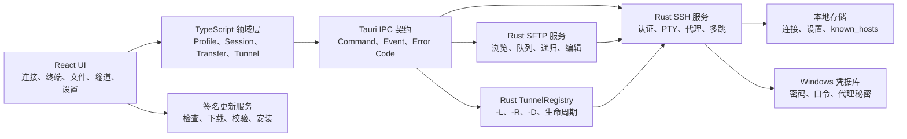

# TerminalT 总体开发文档

> 文档状态：草案基线  
> 基线日期：2026-08-20  
> 当前版本：0.1.0-11
> 对标版本：本机 XTerminal 5.7.17.370  
> 适用范围：Windows 桌面端 SSH、SFTP 与服务器运维能力

## 1. 文档目的

本文在现有基础版阶段 0～6 已完成的前提下，统一 TerminalT 下一阶段的产品范围、优先级、架构边界、开发顺序、测试策略和发布门槛。

本文解决以下问题：

- 明确 TerminalT 从“轻量 SSH 客户端”成长为“可替代 XTerminal 核心 SSH 工作流”的必要能力；
- 区分阻断真实连接场景的必备功能、提高运维效率的增强功能和暂不投入的扩展功能；
- 将后续开发拆成可独立验收、可安全迁移、可按版本发布的阶段；
- 为 React、Tauri IPC、Rust SSH/SFTP 服务、数据迁移和发布工程提供统一边界；
- 防止在认证、隧道、递归文件操作和自动更新等高风险能力中遗漏安全与恢复设计。

本文不是单个版本的详细接口设计。每个阶段启动前仍需补充对应的产品需求、架构说明、测试计划和验收记录。

## 2. 产品定位

TerminalT 保持以下定位：

- 本地优先，不要求注册账号；
- Windows 首发，优先服务开发者、运维人员和个人服务器用户；
- 以 SSH-2、终端、SFTP 和 SSH 隧道为核心，不追求覆盖所有远程桌面协议；
- 默认使用安全算法、主机密钥校验和 Windows 凭据库；
- 不记录终端输入输出正文，不把密码、私钥或验证码写入普通配置和日志；
- 高风险操作必须可见、可取消、可诊断，并具备明确的失败恢复路径。

目标不是逐项复制 XTerminal，而是在不引入账号和云服务复杂度的情况下，覆盖其最关键的本地 SSH 运维闭环。

## 3. 当前基线

现有阶段 0～6 已形成可安装的基础版，主要能力如下：

| 功能域 | 当前能力 | 当前边界 |
| --- | --- | --- |
| 连接资产 | 新建、编辑、复制、删除、搜索、快速连接、单层分组 | 无树形分组、多选批量操作和外部客户端迁移 |
| SSH 认证 | 密码、RSA/ECDSA/Ed25519 私钥、私钥口令 | 无 keyboard-interactive、SSH Agent、证书和硬件密钥 |
| SSH 安全 | 首次指纹确认、指纹变化阻断、Windows 凭据库 | 无多跳链逐跳主机校验和代理凭据模型 |
| 终端 | 多标签、搜索、复制粘贴、安全粘贴、显示设置、手动重连 | 无分屏、布局恢复、广播输入和会话录制 |
| SFTP | 浏览、单文件上传下载、新建目录、重命名、删除、取消和重试 | 无目录递归、批量、拖拽、权限修改和远程编辑 |
| 设置与数据 | 连接超时、keepalive、窗口状态、JSON 导入导出、诊断日志 | 无自动更新、更新通道和更广泛的导入格式 |
| 发布 | Windows NSIS 安装包、版本一致性检查、构建和审计脚本 | 无签名自动更新和更新失败回滚 |

当前基础版范围和已知限制以以下文档为准：

- [`SSH_CLIENT_BASIC_VERSION.md`](./SSH_CLIENT_BASIC_VERSION.md)
- [`development-stages/README.md`](./development-stages/README.md)
- [`release/RELEASE_NOTES_1.0.md`](./release/RELEASE_NOTES_1.0.md)

## 4. 开发前置条件

### 4.1 规范完整性

当前 `AGENTS.md` 引用了以下仓库级规范，但对应文件或项目级 skill 目录在当前工作树中不存在：

- `design/FRONTEND_DESIGN_PROMPT.md`
- `design/clashT主界面设计风格.png`
- `docs/rust-backend-development-guidelines.md`
- `.agents/skills/rust-backend-development/SKILL.md`
- `.agents/skills/pre-commit-ci/SKILL.md`

在开始新增前端页面或 Rust 后端代码前，必须先恢复这些文件，或更新 `AGENTS.md` 指向有效的替代规范。规范缺失期间不得启动阶段 7 之后的代码实现。

### 4.2 开发规则

- 新功能和 bug 修复按需求递增一次 `MAJOR.MINOR.PATCH-N` 末尾版本号；
- 同步更新 `package.json`、`package-lock.json`、`src-tauri/Cargo.toml`、`src-tauri/Cargo.lock` 和 `src-tauri/tauri.conf.json`；
- 每个阶段必须先稳定数据模型和 IPC 契约，再进行前后端并行开发；
- 每个功能必须同时交付异常路径、取消、资源释放、日志脱敏和测试；
- 不允许以关闭主机校验、开启弱算法或记录秘密的方式换取兼容性；
- 每次提交只包含当前需求相关文件，并通过仓库规定的完整本地 CI 等价校验。

## 5. 功能优先级

### 5.1 P0：连接与交付必备

P0 能力决定 TerminalT 是否能够进入常见企业网络并完成完整 SSH 工作流：

1. keyboard-interactive 与 2FA；
2. 每次询问认证和 SSH Agent；
3. Jump Host、多跳、HTTP/SOCKS5 代理；
4. 本地、远程、动态端口转发；
5. SFTP 目录递归、批量传输和权限管理；
6. 签名自动更新和更新失败恢复。

任何 P0 功能存在以下情况时不得标记完成：

- 只能在理想路径运行，无法取消或清理资源；
- 秘密可能进入前端状态、日志、错误详情或导出文件；
- 主机密钥变化、端口占用、网络中断或应用退出没有明确行为；
- 只有单元测试，没有真实协议或 loopback 集成测试；
- 数据模型变更没有向后迁移和回滚策略。

### 5.2 P1：高频运维效率

- 终端横向/纵向分屏和布局保存；
- 标签拖拽排序、重新打开和工作区恢复；
- 快速命令、参数变量和历史回填；
- 并发会话、广播输入和批量文件分发；
- 远程文件编辑；
- 服务器 CPU、内存、磁盘、网络和运行时间监控；
- 连接树形分组、多选、拖拽和共享凭据；
- 可配置自动重连。

### 5.3 P2：后续扩展

- 本地终端；
- 会话录制与回放；
- FIDO/U2F 和 SSH 证书；
- OpenSSH config、XTerminal 等外部格式的完整迁移；
- X11 转发、字符编码和算法高级配置；
- 笔记与插件能力。

### 5.4 当前非目标

以下能力不进入本轮总体路线图：

- AI 助手；
- 云同步、账号体系、团队共享和遥测；
- RDP、Telnet、Serial、Mosh；
- 移动端；
- 默认启用已知不安全的旧式 SSH 算法。

## 6. 目标架构



### 6.1 前端边界

React 负责：

- 表单、状态展示、用户确认和错误本地化；
- 多轮认证提示和临时秘密输入；
- 会话、窗格、传输任务和隧道列表的可视化；
- 取消、重试、恢复和危险操作确认；
- 不持久化秘密，不自行实现 SSH、代理或文件系统协议。

领域模型继续放在 `src/domain`，功能模块继续放在 `src/features`。新增功能建议使用：

```text
src/features/authentication
src/features/tunnels
src/features/workspace
src/features/quick-commands
src/features/monitoring
```

### 6.2 IPC 边界

IPC 必须使用稳定、版本化的数据模型：

- Command 用于低频控制操作；
- Event 用于认证提示、连接进度、终端输出、传输进度和隧道状态；
- 二进制终端与文件数据避免逐字节跨 IPC；
- 错误必须包含稳定错误码、用户消息、可选技术详情和是否可重试；
- 操作 ID、会话 ID、传输 ID 和隧道 ID 使用不可猜测标识；
- 前端响应认证提示时必须携带提示 ID，防止旧响应进入新会话。

### 6.3 Rust 后端边界

后端按职责拆分并保持资源所有权清晰：

- `SshConnector`：TCP、代理、跳板链、握手、主机密钥和认证；
- `SessionRegistry`：PTY Shell、输入输出、resize、keepalive 和关闭；
- `AuthenticationBroker`：keyboard-interactive 提示与响应；
- `TunnelRegistry`：本地监听器、远程监听器、SOCKS5 协商和转发任务；
- `TransferRegistry`：传输排队、并发限制、取消、重试和临时文件；
- `AssetStore`：版本化连接、分组、隧道规则和快速命令；
- `CredentialVault`：所有可保存秘密；
- `UpdateService`：签名校验、版本比较和安装交接。

网络任务必须支持显式取消，应用退出时有界等待。单个会话、传输或隧道失败不得拖垮其他任务。

### 6.4 数据模型演进

连接资产建议从当前 schema v1 逐步增加：

```text
ConnectionProfile
├─ auth: password | privateKey | keyboardInteractive | agent
├─ proxy?: http | socks5
├─ jumpChain?: ConnectionReference[]
├─ startupCommand?: string
└─ encoding: utf8（当前固定）

TunnelProfile
├─ connectionId
├─ kind: local | remote | dynamic
├─ bindHost / bindPort
├─ targetHost / targetPort
└─ startPolicy
```

迁移要求：

- 旧 schema 可自动升级且不丢失连接、分组和凭据引用；
- 导入高版本 schema 时明确拒绝，不做静默降级；
- 导出默认不包含任何秘密；
- 跳板链引用失效时保留配置并给出可修复错误；
- 每个 schema 版本都有固定样例和往返测试。

## 7. 阶段路线图

现有阶段 0～6 维持“基础版已完成”状态。后续新增阶段如下。

| 阶段 | 主题 | 优先级 | 主要成果 | 前置阶段 |
| --- | --- | --- | --- | --- |
| 7 | [认证兼容性](./development-stages/STAGE_7_AUTHENTICATION_COMPATIBILITY.md) | P0 | 交互认证、2FA、每次询问、SSH Agent | 规范恢复 |
| 8 | [网络路径与 SSH 隧道](./development-stages/STAGE_8_NETWORK_PATHS_AND_TUNNELS.md) | P0 | 代理、多跳、`-L/-R/-D` | 7 |
| 9 | [SFTP 完整工作流](./development-stages/STAGE_9_COMPLETE_SFTP_WORKFLOW.md) | P0 | 目录递归、批量、权限、队列恢复 | 7 |
| 10 | [安全更新与发布](./development-stages/STAGE_10_SECURE_UPDATES_AND_RELEASE.md) | P0 | 签名自动更新、通道、回滚验证 | 7；可与 8/9 并行 |
| 11 | [终端工作区效率](./development-stages/STAGE_11_TERMINAL_WORKSPACE.md) | P1 | 分屏、布局、标签增强、自动重连 | 8 |
| 12 | [运维生产力](./development-stages/STAGE_12_OPERATIONS_PRODUCTIVITY.md) | P1 | 快速命令、并发会话、监控、远程编辑 | 9、11 |

### 7.1 阶段 7：认证兼容性

目标：覆盖密码、私钥之外的常见企业 SSH 登录流程。

范围：

- keyboard-interactive 多轮提示；
- 密码、验证码和确认类提示的安全展示；
- “每次询问”认证，不保存秘密；
- SSH Agent 密钥枚举、签名请求和失败回退；
- 认证方式与连接资产 schema 迁移；
- 连接测试与正式连接共享同一认证状态机。

安全要求：

- 提示文本来自远端，应作为不可信文本转义展示；
- 用户响应只在内存保留，使用后尽快清理；
- 不在错误、诊断日志、重试状态或前端持久化中保存响应；
- 认证对话框取消必须终止对应网络任务；
- 连续失败限制不能误伤多轮 2FA 的正常步骤。

验收：

- OpenSSH keyboard-interactive 单提示和多提示均可登录；
- 密码加 TOTP 的两阶段流程可完成、取消并重试；
- Agent 无密钥、密钥被拒绝、Agent 不可用时错误可理解；
- 10 次重复连接/取消后无遗留会话和认证等待任务；
- 日志与导出文件秘密扫描为零命中。

退出条件：认证状态机、数据迁移、自动化测试和真实服务器验收全部完成。

### 7.2 阶段 8：网络路径与 SSH 隧道

目标：让 TerminalT 能进入企业内网并覆盖 SSH 的核心网络转发用途。

范围：

- HTTP CONNECT 与 SOCKS5 代理；
- 单跳 Jump Host，再扩展为可排序多跳链；
- 每一跳独立认证与主机密钥校验；
- 本地转发 `-L`；
- 远程转发 `-R`；
- 动态 SOCKS5 转发 `-D`；
- 隧道规则保存、启动、停止、状态、错误和连接复用。

安全要求：

- 本地和动态转发默认只监听 `127.0.0.1`；
- 监听 `0.0.0.0` 或启动远程转发时显示风险说明；
- 每一跳主机指纹变化都必须阻断；
- 代理密码进入 Windows 凭据库；
- 禁止循环跳板引用；
- 端口占用、半开连接和应用退出必须释放监听器。

验收：

- 单跳和三跳 loopback 拓扑连接成功；
- HTTP/SOCKS5 代理的有认证和无认证场景通过；
- `-L/-R/-D` 均通过 TCP echo 与并发连接测试；
- 隧道断线后状态准确，不产生静默假在线；
- 重复启停 100 次无端口、任务或句柄泄漏；
- 终端与隧道共享连接时，关闭任一侧不误伤另一侧。

退出条件：三类隧道和代理/多跳均具备可观测生命周期与集成测试。

### 7.3 阶段 9：SFTP 完整工作流

目标：将当前单文件面板提升为可处理日常部署和日志收集的文件工具。

范围：

- 多选、全选和批量操作；
- 文件夹递归上传、下载和删除；
- 目录拖拽上传、文件拖拽下载；
- 权限查看和 chmod；
- 传输队列、并发上限、暂停或取消、失败重试；
- 临时文件加原子替换，避免失败下载留下完整名称的损坏文件；
- 第一阶段不承诺跨服务器断点续传，先保证同一任务内可靠恢复。

安全要求：

- 递归遍历防止软链接循环和路径逃逸；
- 递归删除展示目标根路径、数量和不可恢复警告；
- 本地覆盖和远端覆盖都必须明确确认；
- 取消上传时清理应用创建的远端临时文件；
- 权限修改使用 SFTP 属性接口，禁止拼接 Shell 命令；
- 文件名和远端路径作为不可信数据处理。

验收：

- 1,000 文件目录树上传和下载结果一致；
- 空目录、隐藏文件、Unicode 文件名和深层路径通过；
- 权限不足、磁盘不足、网络中断和取消均有确定结果；
- 并发任务不超过配置上限，排队顺序稳定；
- 删除包含软链接的目录不会越过用户选择的根路径；
- 大文件传输期间终端仍可交互。

退出条件：批量目录工作流、危险操作保护和压力测试完成。

### 7.4 阶段 10：安全更新与发布

目标：使已安装客户端能够安全、可控地获得修复版本。

范围：

- 稳定更新通道；
- 手动检查更新和可配置启动检查；
- 签名元数据、下载进度、版本说明和安装确认；
- 更新失败继续运行旧版本；
- 版本降级和重复安装保护；
- 发布产物、校验和、签名和更新清单自动化。

安全要求：

- 未通过签名和哈希校验的包不得执行；
- 更新源使用 HTTPS，更新地址不接受任意运行时覆盖；
- 私钥只存在于受控发布环境；
- 更新日志和错误不包含本机路径中的敏感信息；
- 自动更新不绕过 Windows 安装确认和权限边界。

验收：

- 旧版本可升级到新版本，应用数据和凭据保持完整；
- 篡改包、错误签名、断网、下载中断和磁盘不足均安全失败；
- 同版本不重复安装，高版本不会被低版本静默覆盖；
- NSIS 全新安装、覆盖安装和卸载路径重新验收。

退出条件：签名更新链路在隔离测试源和正式发布源分别验证通过。

### 7.5 阶段 11：终端工作区效率

目标：支持多任务并行观察和稳定恢复工作区布局。

范围：

- 横向和纵向分屏；
- 窗格树、拖拽尺寸和布局模板；
- 标签拖拽排序、复制会话入口和关闭标签恢复；
- 应用重启后恢复连接入口与布局，不自动恢复前台进程；
- 可配置自动重连、最大次数和退避；
- 快捷键集中管理与冲突检测。

安全与恢复：

- 不持久化临时凭据、终端缓冲和未发送输入；
- 自动重连不得绕过需要重新输入的认证；
- 分屏关闭只影响目标会话；
- 恢复布局失败时回退为普通标签，不阻止应用启动。

验收：

- 10 会话、多层分屏下输入输出不串线；
- 拖拽、resize 和标签切换期间 PTY 尺寸正确；
- 崩溃或强制退出后的布局数据可解析并安全降级；
- 自动重连在网络抖动、认证过期和手动关闭时行为符合设置。

退出条件：工作区模型、快捷键、恢复和压力测试全部完成。

### 7.6 阶段 12：运维生产力

目标：减少重复命令输入和在多台服务器间切换的成本。

范围：

- 快速命令分组、搜索、参数变量和历史回填；
- 粘贴到终端与立即执行分离；
- 并发会话和显式广播模式；
- 批量文件分发；
- CPU、内存、磁盘、网络、负载和运行时间监控；
- 小型远程文本文件编辑、保存冲突检测和编码限制。

安全要求：

- 广播和立即执行使用高可见状态，默认关闭；
- 多行或危险命令沿用安全粘贴确认；
- 快速命令参数不隐式进入日志；
- 监控采集频率可配置且有超时，不与交互 Shell 争抢输出；
- 远程编辑保存前检测修改时间或内容版本，避免静默覆盖。

验收：

- 参数化命令能预览最终文本再粘贴或执行；
- 广播目标列表清晰，断开的会话不会被计为成功；
- 20 台 loopback 会话并发执行结果可分别追踪；
- 监控关闭后不再产生远端采集任务；
- 远程文件被其他进程修改时提示冲突。

退出条件：效率功能不会降低终端安全性、隔离性和响应性。

## 8. 测试策略

### 8.1 测试层级

| 层级 | 重点 |
| --- | --- |
| TypeScript 单元测试 | 表单校验、模型迁移、状态 reducer、快捷键、布局树 |
| Rust 单元测试 | 路径校验、状态机、错误映射、代理协议、SOCKS5 解析 |
| Rust 集成测试 | OpenSSH loopback、跳板拓扑、隧道 echo、SFTP 临时目录 |
| 前后端契约测试 | Command/Event 字段、错误码、版本兼容和取消竞态 |
| 桌面端验收 | IME、剪贴板、拖拽、窗口恢复、安装与更新 |
| 压力与恢复测试 | 大输出、大目录、多会话、重复启停、断网和强制退出 |
| 安全测试 | 秘密扫描、路径逃逸、指纹变化、签名篡改和危险监听地址 |

### 8.2 真实环境矩阵

至少覆盖：

- Windows 10 1809、Windows 11 当前稳定版；
- OpenSSH Server 当前稳定版和一个仍受支持的旧版本；
- 密码、无口令私钥、带口令私钥、keyboard-interactive、Agent；
- IPv4、IPv6、域名、非 22 端口；
- 直连、HTTP 代理、SOCKS5 代理、单跳和三跳；
- 高延迟、丢包、主动断开和 DNS 失败；
- 小文件、大文件、1,000+ 文件目录、Unicode 和权限不足。

### 8.3 错误码要求

新增功能至少定义以下稳定错误域：

```text
AUTH-INTERACTIVE-*
AUTH-AGENT-*
PROXY-*
JUMP-HOST-*
TUNNEL-*
SFTP-RECURSIVE-*
TRANSFER-QUEUE-*
UPDATE-*
WORKSPACE-RESTORE-*
```

错误码一经公开不得随意复用为不同语义。用户消息本地化，技术详情可复制但必须脱敏。

## 9. 统一完成定义

一个阶段只有同时满足以下条件才能标记“已完成”：

1. 范围内主路径、异常路径、取消和恢复均已实现；
2. 数据模型、IPC 契约和错误码已文档化；
3. 单元、集成和适用的桌面人工验收通过；
4. 无阻断级、严重级已知缺陷；
5. 日志、导出、崩溃信息和持久化文件通过秘密扫描；
6. 应用退出不会遗留监听器、SSH 会话、SFTP 任务或更新任务；
7. 版本文件和锁文件同步，版本校验及发布测试通过；
8. 对应架构说明、测试记录、发布说明和已知限制更新；
9. 只提交当前需求相关变更，并使用 Conventional Commits；
10. 安装包可在干净 Windows 环境完成安装、升级和卸载验证。

## 10. 发布里程碑

| 里程碑 | 包含阶段 | 发布判定 |
| --- | --- | --- |
| 专业连接 Beta | 7、8 | 企业认证、代理、多跳和隧道可用 |
| 文件工作流 Beta | 9 | 目录和批量 SFTP 可用 |
| 安全发布 RC | 10 | 安装与签名更新链路通过 |
| 工作区 RC | 11 | 分屏、布局和重连稳定 |
| 核心替代版 | 12 | 覆盖 XTerminal 的本地 SSH 核心运维工作流 |

每个里程碑可以包含多个功能，但同一个用户需求只递增一次版本。阶段未通过验收时不得以“预览完成”名义进入稳定发布通道。

## 11. 主要风险与应对

| 风险 | 影响 | 应对 |
| --- | --- | --- |
| `russh` 对交互认证、Agent 或转发接口支持不足 | 需要扩展底层协议实现 | 阶段启动前做最小技术验证，避免先写 UI |
| 多跳和连接复用导致生命周期耦合 | 关闭一个功能误断其他任务 | 引入明确的连接所有权和引用计数模型 |
| 递归 SFTP 路径与软链接处理错误 | 越界删除或无限遍历 | 根路径约束、访问集合、深度/数量上限和测试树 |
| 动态转发监听外网地址 | 无意暴露代理 | 默认 localhost，外网监听二次确认并明显标识 |
| 自动更新供应链被篡改 | 执行恶意安装包 | 离线签名、固定公钥、HTTPS、哈希和失败关闭 |
| 分屏和高频监控增加渲染压力 | 终端卡顿或丢输入 | 输出批处理、隐藏窗格降频、压力测试和性能预算 |
| 数据 schema 频繁变化 | 导入导出或升级损坏 | 单向版本迁移、固定样例、备份和往返测试 |
| 仓库规范文件缺失 | 开发行为失去统一标准 | 恢复规范作为阶段 7 启动硬门槛 |

## 12. 性能预算

在现有基础版指标上增加：

- 三跳连接除网络握手外，应用额外调度开销不超过 300 ms；
- 单个隧道支持至少 100 个短连接且 UI 保持可交互；
- 10 个终端窗格持续输出时不串线、不丢输入；
- 1,000 文件目录递归任务可取消，取消反馈不超过 1 秒；
- 20 个监控目标默认采集周期下不阻塞终端输入；
- 更新检查不阻塞首屏，失败不影响离线使用。

具体数值应在阶段技术验证后根据测试设备修订，但不得删除可测量的性能门槛。

## 13. 文档维护

- 本文由产品范围或阶段优先级变化触发更新；
- 每个阶段新增 `docs/development-stages/STAGE_N_*.md`；
- 协议和模块决策新增对应 `docs/architecture/STAGE_N_*.md`；
- 自动化和人工验收记录放在 `docs/testing`；
- 发布范围、已知限制和迁移说明同步更新到 `docs/release`；
- 如果功能退出路线图，应在本文记录原因，不直接删除历史决策。

## 14. 对标参考

- XTerminal 功能简介：https://docs.xterminal.cn/
- 交互认证与 2FA：https://docs.xterminal.cn/ssh/auth-2fa/
- 多跳代理：https://docs.xterminal.cn/ssh/proxy-jump/
- 端口转发：https://docs.xterminal.cn/port-forwarding/overview/
- SFTP 文件浏览器：https://docs.xterminal.cn/sftp/browser
- SFTP 权限管理：https://docs.xterminal.cn/sftp/permissions/
- 远程编辑：https://docs.xterminal.cn/sftp/remote-edit/
- 终端基础操作与分屏：https://docs.xterminal.cn/terminal/basic-operations/
- 快速命令：https://docs.xterminal.cn/quick-commands/overview/
- 软件更新：https://docs.xterminal.cn/settings/update/
