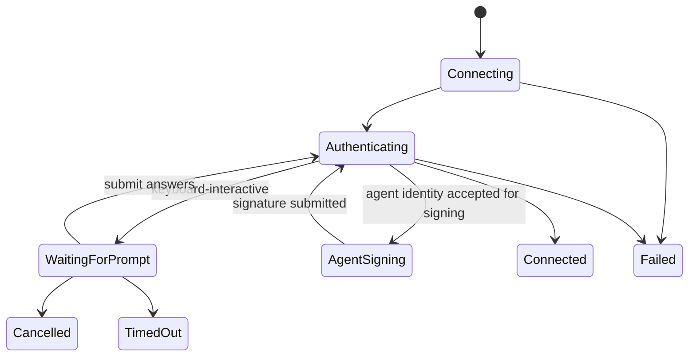

# 阶段 7 认证兼容性架构

## 目标与边界

阶段 7 在原有密码、私钥认证上增加 `keyboardInteractive` 和 `agent`。认证状态由 Rust 持有，React 只展示服务器问题、提交与当前操作绑定的回答。FIDO、PKCS#11、证书和智能卡仍不在本阶段范围。

## 数据与迁移

连接资产 schema 从 1 升至 2。旧 schema 0、1 在读取时单向迁移并原子回写；未来版本继续拒绝。`agentKeyFingerprint` 只保存公钥 SHA-256 指纹作为尝试顺序偏好。交互回答、验证码、Agent 签名和公钥 blob 不进入连接资产、导出文件、凭据库或诊断日志。

四类认证数据规则：

| 类型 | 可持久化 | 临时数据 |
| --- | --- | --- |
| `password` | 可选 Windows 凭据引用 | 未记住时每次输入 |
| `privateKey` | 私钥路径、可选口令凭据引用 | 未记住的口令 |
| `keyboardInteractive` | 认证类型 | 服务器逐轮问题的回答 |
| `agent` | 可选首选公钥指纹 | Agent 签名结果 |

## AuthenticationBroker

每轮服务器问题创建新的 UUID `promptId`，记录 `operationId`、有序回答 ID 和一次性发送端。响应必须同时匹配操作、提示和回答顺序。响应、取消、超时或等待任务销毁都会移除记录；迟到及重复响应返回 `AUTH-PROMPT-STALE`。

交互认证最多 16 轮、每轮最多 16 个问题，单轮等待 120 秒。服务器的 `name`、`instructions` 和问题仅以 React 文本节点显示；输入框只依据协议 `echo` 标志决定是否遮挡。

## SSH Agent

Windows 通过 `\\.\pipe\openssh-ssh-agent` 连接系统 OpenSSH Agent。应用只枚举公钥元数据，过滤本阶段不支持的证书身份；首选指纹优先，其余密钥按 Agent 顺序继续尝试。签名仍由 Agent 完成，私钥不进入 TerminalT 进程。

稳定错误码包括：`AUTH-INTERACTIVE-UNAVAILABLE`、`AUTH-INTERACTIVE-TIMEOUT`、`AUTH-INTERACTIVE-REJECTED`、`AUTH-PROMPT-STALE`、`AUTH-AGENT-UNAVAILABLE`、`AUTH-AGENT-NO-KEYS`、`AUTH-AGENT-SIGN-FAILED` 和 `AUTH-AGENT-REJECTED`。

## 一致性与取消

连接测试、新连接、已保存连接和手动重连都进入同一 `connect_authenticated` 状态机。交互认证的总建立时限为 150 秒，独立于普通网络超时。取消操作先清理 broker，再取消连接任务；前端 Escape、取消按钮和关闭连接均使用相同取消命令。
